# CharTii-i18n

<div align="center">

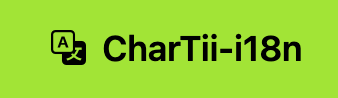

**AI-powered multilingual translation management system for JSON language packs**

[](https://opensource.org/licenses/MIT)
[](https://www.python.org/downloads/)
[](https://github.com/zbmbase/chartii-i18n/releases)

</div>

## Overview

CharTii-i18n is a comprehensive web-based toolkit that streamlines the end-to-end workflow for maintaining application language packs. It provides an intuitive Flask web dashboard, a powerful AI translation engine, and robust synchronization capabilities to help you manage multilingual projects efficiently.

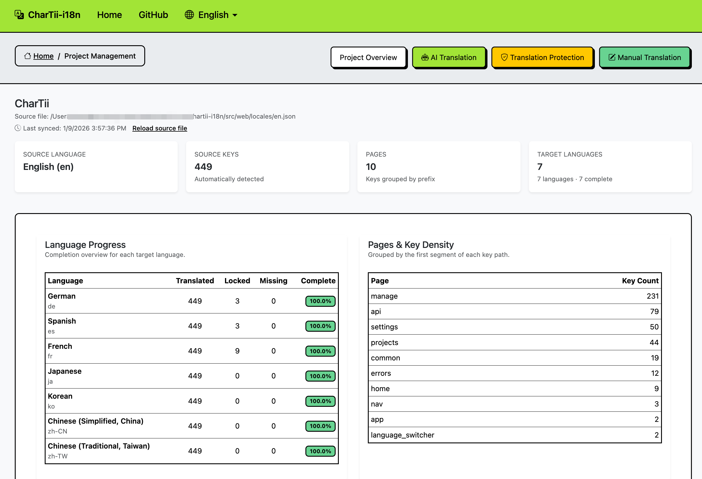

## Projects Using CharTii-i18n

The following projects are using CharTii-i18n for their internationalization:

- **[Pixabc](https://pixabc.com)** - Free Online Image Tools

If you have successfully deployed CharTii-i18n for your project's multilingual support, we'd love to hear from you! Please [share your project in Discussions](https://github.com/zbmbase/chartii-i18n/discussions) and we'll add it to this list.

### Key Features

- 🤖 **AI-Powered Translation** - Built-in support for OpenAI, Gemini, and DeepSeek; configurable OpenAI-compatible APIs (remote or local)
- 🔄 **Automatic Synchronization** - Detects new, updated, and deleted keys from source files
- 🛡️ **Protected Terms Management** - Preserve brand names, technical terms, URLs, and code snippets
- ✏️ **Manual Translation** - Fine-tune translations with a dedicated manual translation interface
- 📊 **Progress Tracking** - Real-time translation progress with detailed statistics
- 🌍 **Multi-language Support** - Manage translations for unlimited target languages
- 🔍 **Smart Validation** - Automatic validation of translations to ensure quality
- 📁 **Fast Export** - Generate language pack files for all locales instantly

## Table of Contents

- [Installation](#installation)
- [Quick Start](#quick-start)
- [Features](#features)
- [Usage Scenarios](#usage-scenarios)
- [Configuration](#configuration)
- [Project Structure](#project-structure)
- [Contributing](#contributing)
- [License](#license)

## Installation

### Prerequisites

- Python 3.9 or higher
- pip (Python package manager)

### Step 1: Clone the Repository

```bash
git clone https://github.com/zbmbase/chartii-i18n.git
cd chartii-i18n
```

### Step 2: Create Virtual Environment

```bash
python -m venv .venv
source .venv/bin/activate  # On Windows: .venv\Scripts\activate
```

### Step 3: Install Dependencies

```bash
pip install -r requirements.txt
```

## Quick Start

### 1. Launch the Application

```bash
python run.py
```

The web dashboard will be available at `http://localhost:5500`

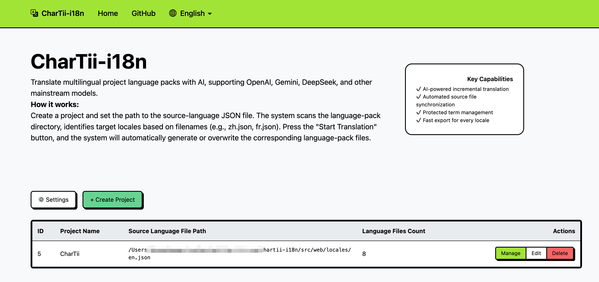

### 2. Configure AI Provider

Before using translation features, you need to configure your AI provider credentials:

1. Click the **Settings** button on the home page
2. Select your AI provider (OpenAI, DeepSeek, Gemini, or a custom provider)
3. Enter your API key
4. For custom providers, also configure the API URL (e.g., `http://localhost:8000/v1/chat/completions` for local APIs)
5. Select the model you want to use
6. Save the configuration

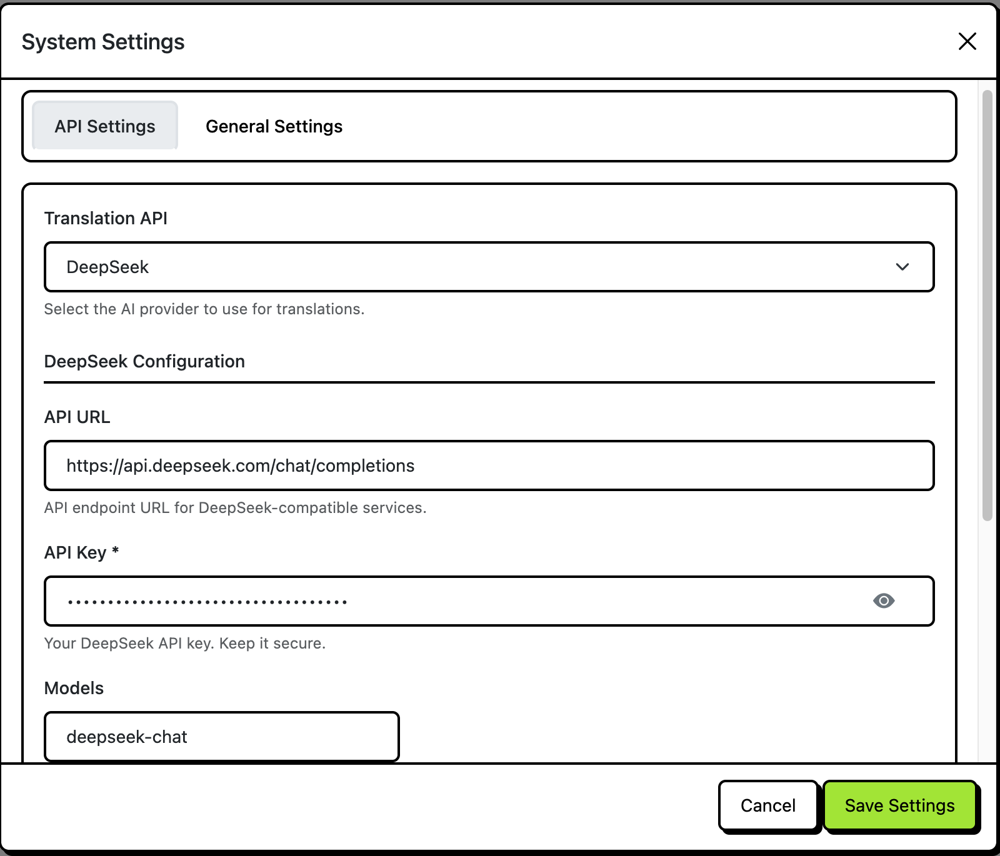

### 3. Create Your First Project

1. Click **Create Project** on the home page
2. Enter a project name
3. Set the path to your source language JSON file (e.g., `lang_pack/en.json`)
4. Add translation context (optional but recommended for better translation quality)
5. Choose import mode:
   - **Retranslate**: Re-translate all existing translations
   - **Merge**: Keep existing translations and only translate missing keys
6. Click **Create**

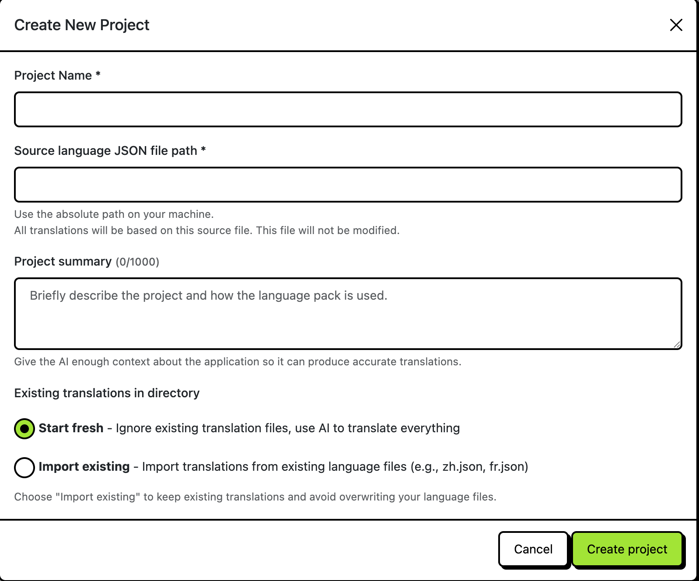

### 4. Start Translation

1. Click **Manage** on your project
2. Navigate to the **AI Translation** tab
3. Select target languages
4. Choose translation strategy:
   - **Missing Only** (Recommended): Only translate missing keys
   - **Missing + AI Translated**: Re-translate AI-generated translations
   - **Full Translation**: Re-translate everything (use with caution)
   - **Validate Only**: Only validate existing translations
5. Click **Start Translation**

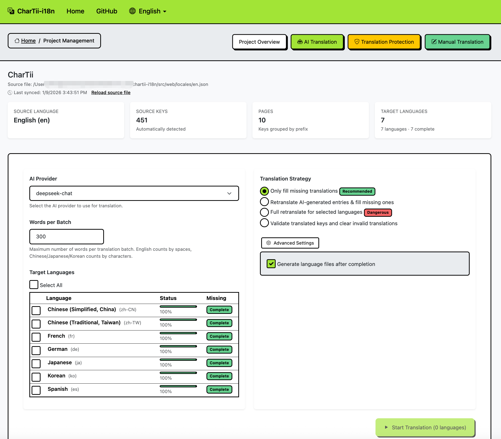

## Features

### AI-Powered Translation

CharTii-i18n supports multiple AI providers:

- **Built-in Providers**: OpenAI (GPT-4o, GPT-4o-mini, GPT-5, etc.), DeepSeek (DeepSeek Chat), Gemini (Gemini 2.5 Flash, etc.)
- **Custom Providers**: Configure any OpenAI-compatible API endpoint (remote or local) by setting `api_url`, `api_key`, and `models` in the configuration

The system automatically batches translations for efficiency and handles retries on failures.

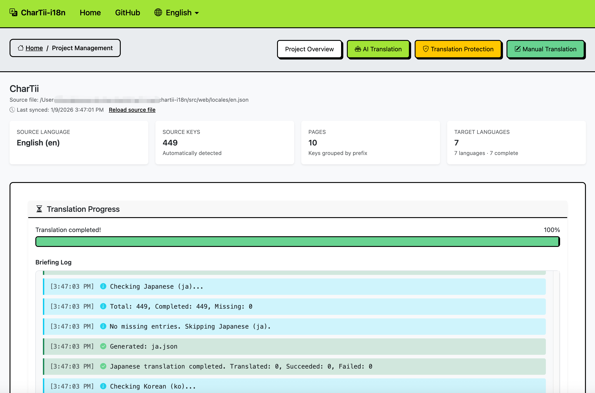

### Protected Terms Management

Protect specific terms from being translated:

- **Brand Names**: Company names, product names
- **Technical Terms**: Domain-specific terminology
- **URLs**: Keep URLs unchanged
- **Code Snippets**: Preserve code patterns

You can add protected terms manually or use AI analysis to suggest terms automatically.

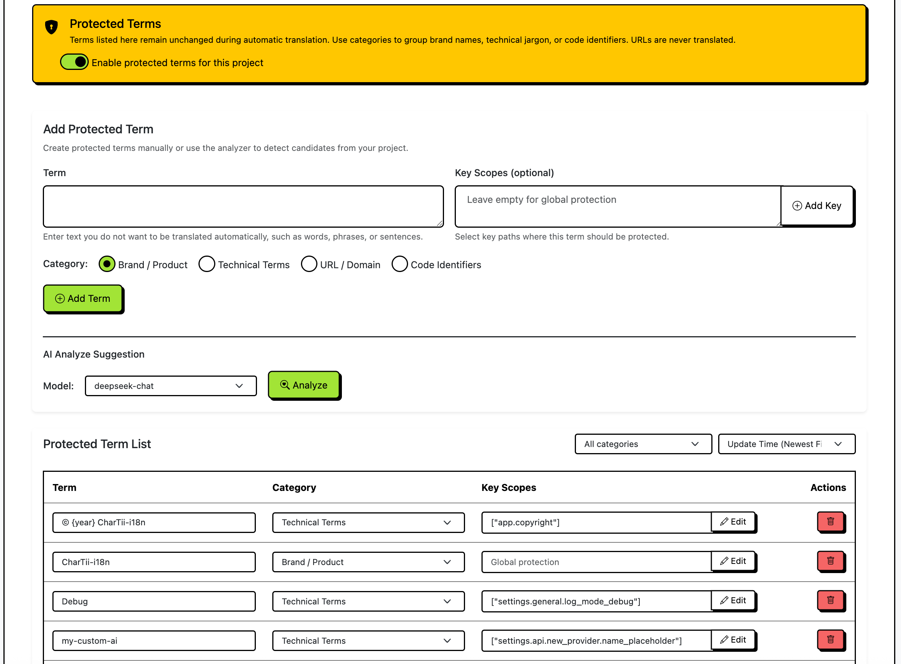

### Manual Translation

For critical translations that require human review:

1. Search for keys you want to translate manually
2. Add them to your manual translation worklist
3. Enter translations for each target language
4. Save and lock translations to prevent AI from overwriting them

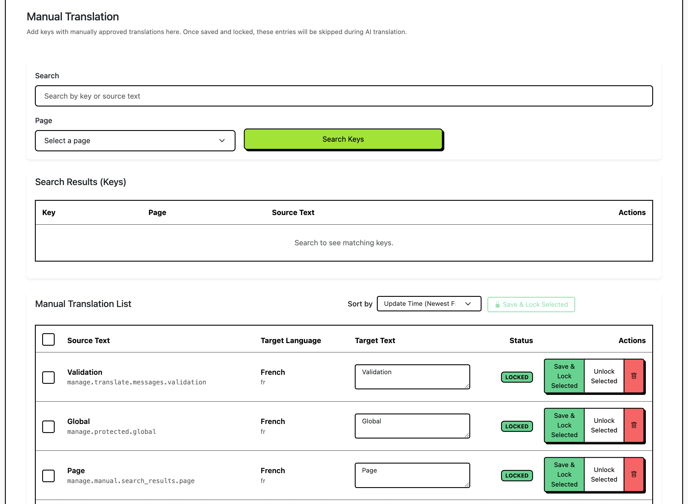

### Automatic Synchronization

The system automatically detects changes in your source language file:

- **New Keys**: Automatically added to the translation queue
- **Updated Keys**: Marked for re-translation if needed
- **Deleted Keys**: Removed from all language packs

You can manually trigger synchronization by clicking **Reload Source** in the project overview.

## Usage Scenarios

### Scenario 1: Handling Failed Translation Keys

When translation fails for certain keys, the system provides several options:

#### View Failed Keys

After a translation job completes, if there are failed keys:

1. Click **View Failed Keys** in the translation progress log
2. Review the list of failed keys with error messages
3. Understand why each key failed (e.g., validation errors, API errors)

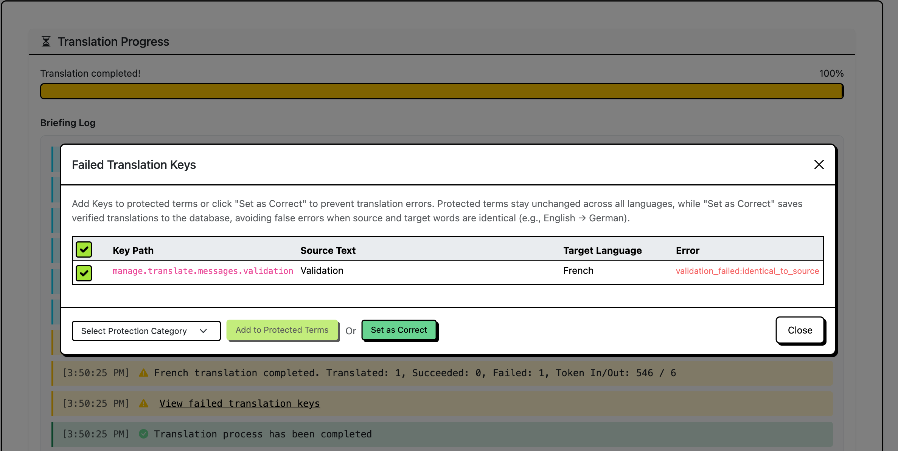

#### Option 1: Add to Protected Terms

If a key failed because it contains terms that shouldn't be translated:

1. Select the failed keys
2. Choose a protection category (Brand, Technical, URL, or Code)
3. Click **Add to Protected Terms**
4. The terms will be protected in future translations

#### Option 2: Mark as Correct

If the translation is actually correct but failed validation:

1. Select the failed keys
2. Click **Set as Correct**
3. The translations will be saved and marked as valid

#### Option 3: Manual Translation

For keys that require human intervention:

1. Note the key paths from the failed keys list
2. Go to the **Manual Translation** tab
3. Search for the keys
4. Add them to your worklist
5. Enter correct translations manually

### Scenario 2: When to Use Protected Terms

Use protected terms in the following situations:

#### Brand Names and Product Names

If your application mentions brand names or product names that should remain unchanged:

```
Example:
Source: "Welcome to Chartii"
Protected: "Chartii"
Result: "Bienvenue sur Chartii" (French) - brand name preserved
```

#### Technical Terminology

For domain-specific terms that have standard translations or should remain in English:

```
Example:
Source: "API endpoint configuration"
Protected: "API", "endpoint"
Result: "Configuration du point de terminaison API" (French)
```

#### URLs and Links

URLs should always remain unchanged:

```
Example:
Source: "Visit https://example.com for more info"
Protected: "https://example.com"
Result: "Visitez https://example.com pour plus d'informations" (French)
```

#### Code Snippets

Code patterns and snippets should not be translated:

```
Example:
Source: "Use {{ variable }} in your template"
Protected: "{{ variable }}"
Result: "Utilisez {{ variable }} dans votre modèle" (French)
```

#### Using AI Analysis

The system can automatically analyze your source files and suggest protected terms:

1. Go to **Protected Terms** tab
2. Select an AI model
3. Click **Analyze**
4. Review suggested terms
5. Select and apply the terms you want to protect

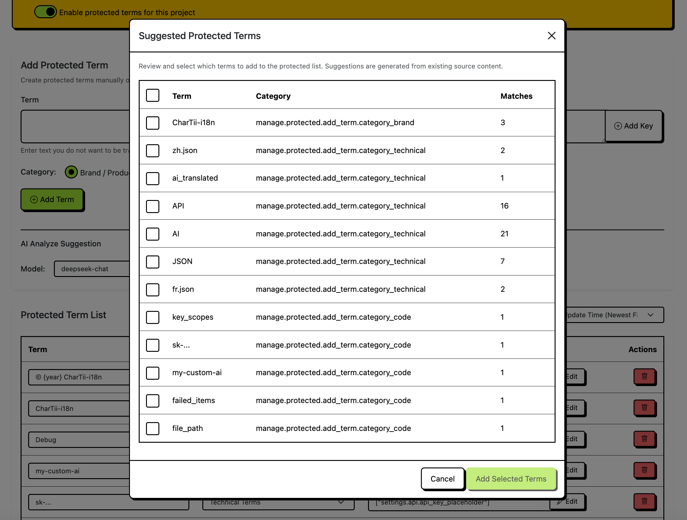

### Scenario 3: When to Use Manual Translation

Use manual translation for:

#### Critical User-Facing Content

For important UI text that requires precise translation:

- Error messages
- Success messages
- Navigation labels
- Button text

#### Cultural Adaptations

When translations need cultural context or localization:

- Date formats
- Currency formats
- Regional expressions
- Cultural references

#### Legal or Compliance Text

For content that must be exactly as specified:

- Terms of service
- Privacy policy
- Legal disclaimers
- Compliance notices

#### Workflow

1. Go to **Manual Translation** tab
2. Search for keys by key path or source text
3. Filter by page if needed
4. Click **Add to Manual List** for selected keys
5. Select target languages
6. Enter translations in the worklist
7. Save and lock translations to prevent AI overwrites

### Scenario 4: Translation Strategies

#### Missing Only (Recommended)

**When to use**: First-time translation or adding new languages

- Only translates keys that don't have translations yet
- Fastest and most cost-effective
- Preserves existing manual translations

#### Missing + AI Translated

**When to use**: Improve existing AI-generated translations

- Re-translates keys that were previously translated by AI
- Keeps manual translations unchanged
- Useful when you've improved your translation context

#### Full Translation

**When to use**: Major context changes or model upgrades

- Re-translates everything, including locked translations (if enabled)
- Use with extreme caution
- Requires explicit confirmation

#### Validate Only

**When to use**: Check translation quality without making changes

- Validates existing translations
- Reports validation errors
- No translations are modified

## Configuration

### AI Provider Configuration

Configure your AI provider through the web interface:

1. Click the **Settings** button on the home page
2. Select your AI provider (OpenAI, DeepSeek, Gemini, or a custom provider)
3. Enter your API key
4. For custom providers, configure the API URL (e.g., `http://localhost:8000/v1/chat/completions` for local APIs)
5. Select the model you want to use
6. Save the configuration

Custom providers must use OpenAI-compatible API format (same request/response structure).

### Translation Settings

- **Words per Batch**: Control how many words are sent to AI in each request (default: 300)
- **Variable Patterns**: Configure patterns for preserving variables in translations
- **Protected Terms**: Enable/disable protected terms feature per project

## Project Structure

```
chartii-i18n/
├── run.py                 # Web service entry point
├── requirements.txt       # Python dependencies
├── LICENSE                # MIT License
├── README.md             # This file
├── src/                   # Source code
│   ├── web/              # Flask application
│   │   ├── app.py        # Flask app factory
│   │   ├── routes/       # API routes
│   │   ├── templates/    # HTML templates
│   │   ├── static/       # CSS, JS, and assets
│   │   └── locales/      # UI translations
│   ├── ai/               # AI service integration
│   │   ├── service.py    # AI service wrapper and translation logic
│   │   ├── providers.py  # AI provider API implementations
│   │   └── exceptions.py # AI-related exceptions
│   ├── core/             # Core functionality
│   │   ├── database.py   # SQLite database layer
│   │   ├── sync.py       # File synchronization
│   │   └── validation.py # Translation validation
│   ├── translation/      # Translation engine
│   ├── protection/       # Protected terms management
│   └── project/          # Project management
└── logs/                 # Application logs
```

## Project Structure Details

- **Database**: SQLite database stores all projects, translations, and protected terms
- **Synchronization**: Automatic detection of changes in source language files
- **Translation Engine**: Batched AI translation with progress tracking and retry logic
- **Validation**: Automatic validation of translations for placeholder preservation and quality

## License

This project is licensed under the MIT License - see the [LICENSE](LICENSE) file for details.

## Acknowledgments

- Built with [Flask](https://flask.palletsprojects.com/)
- UI powered by [Bootstrap](https://getbootstrap.com/)
- Icons from [Bootstrap Icons](https://icons.getbootstrap.com/)

---

<div align="center">

Made with ❤️ for the internationalization community

[Report Bug](https://github.com/zbmbase/chartii-i18n/issues) · [Request Feature](https://github.com/zbmbase/chartii-i18n/issues)

</div>
